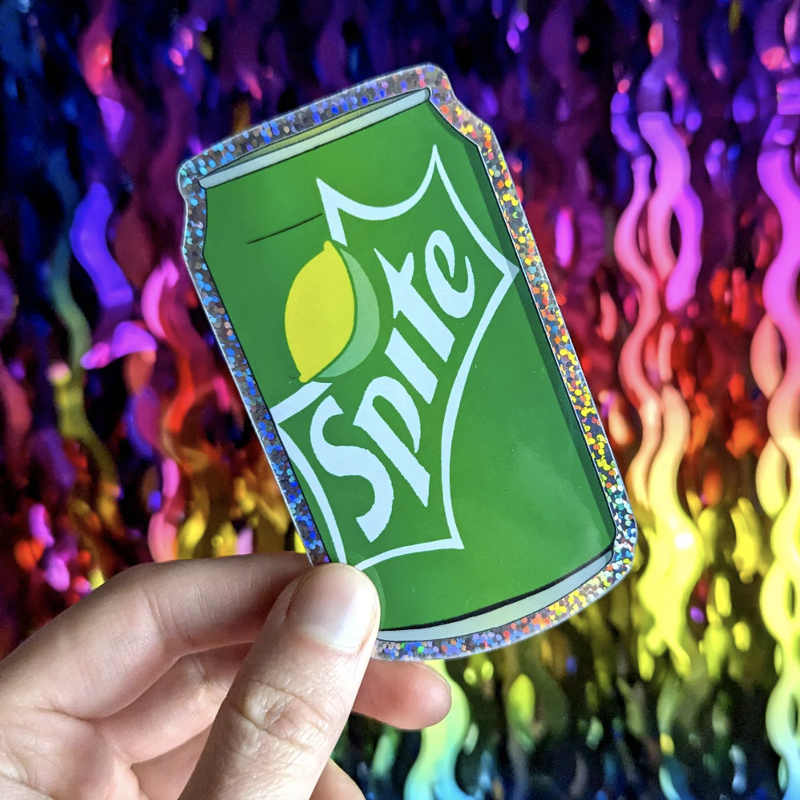

# Портфолио

# Задача №1: Публикация репозитория

# Задача №2: Создание веток

## Список клиентов
Мы на столько крутые, что уже успели поработать со следующими компаниями:

1. ООО «Рога и копыта»
2. Издательство «Читый лист»
3. Космопорт «Черезтерновый Кзвёздный»
4. Дизайн-студия имени Слишком Известного Персонажа
   
Нас можно найти в <u>[google.com](https://google.com)</u>.

4. Сделайте коммит с изменениями.
5. Отправьте коммит в репозиторий: ```git push -u origin new-text```.
6. Откройте репозиторий на GitHub в браузере, переключитесь на ветку ```new-text``` и скопируйте ссылку из адресной строки браузера.

Фото: 



Ссылка на фото:

[https://imgur.com/gallery/everything-is-stickers-J5khd4T](https://imgur.com/JilyYkO)

Видео ссылка:

[https://imgur.com/gallery/mead-hMmuGmy](https://imgur.com/gjZRIjQ)
